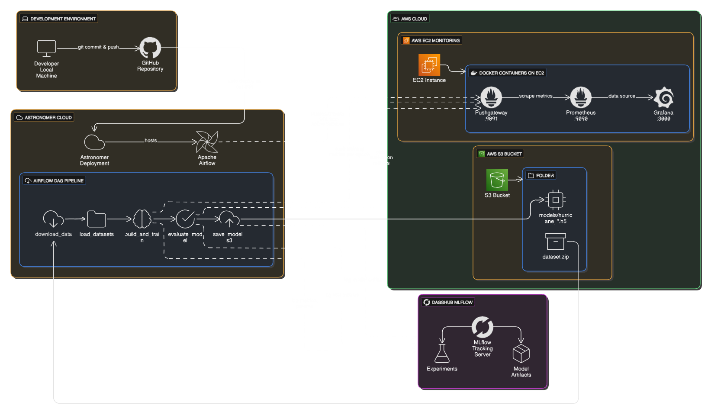
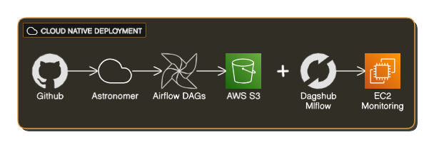
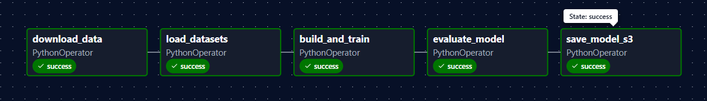
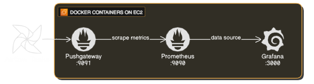
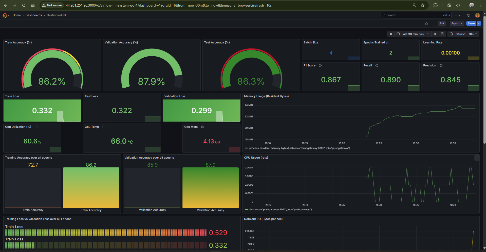
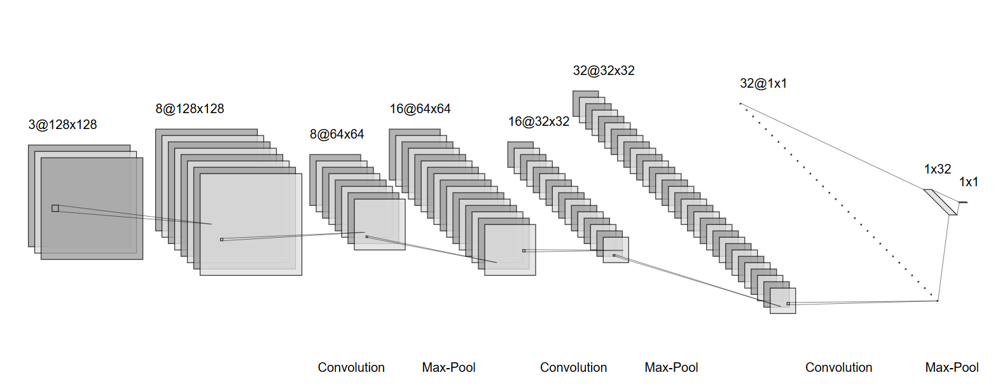

# Hurricane Damage Training Pipeline

[](https://airflow.apache.org/)
[](https://www.astronomer.io/)
[](https://www.tensorflow.org/)
[](https://mlflow.org/)
[](https://prometheus.io/)
[](https://grafana.com/)
[](https://aws.amazon.com/ec2/)
[](https://aws.amazon.com/s3/)

A production-grade MLOps pipeline for training CNN models to classify hurricane damage severity. Built with Apache Airflow for orchestration, deployed on Astronomer Cloud, and monitored with Prometheus/Grafana stack on AWS EC2.



---

## 🏗️ Architecture Overview

### Cloud-Native Deployment



**Key Components:**
- **Orchestration**: Apache Airflow 3.1.9 on Astronomer Cloud 
- **CI/CD**: GitHub-based continuous deployment to Astronomer
- **Storage**: AWS S3 for dataset and model artifacts
- **Experiment Tracking**: DagsHub-hosted MLflow tracking server
- **Monitoring**: Prometheus + Grafana on AWS EC2 with Pushgateway
- **ML Framework**: TensorFlow/Keras for CNN model training

---

## 🚀 Apache Airflow Pipeline

### DAG Architecture

The pipeline follows a **Task-based design** with clear separation of concerns:



#### Task Breakdown

| Task | Module | Responsibility | XCom Output |
|------|--------|----------------|-------------|
| **download_data** | `data_tasks.py` | Downloads `dataset.zip` from S3, extracts to `/tmp/data` | Dataset root path |
| **load_datasets** | `data_tasks.py` | Prepares train/validation/test directory paths | Dataset directories dict |
| **build_and_train** | `training_tasks.py` | Builds CNN, trains model, logs to MLflow, pushes metrics | MLflow run_id |
| **evaluate_model** | `evaluation_tasks.py` | Evaluates on test set, computes F1/precision/recall | Test metrics dict |
| **save_model_s3** | `storage_tasks.py` | Uploads trained model to S3 `models/` folder | S3 URI |

### DAG Configuration

```python
DAG(
    dag_id='hurricane_damage_training_mod',
    schedule=None,  # Manual trigger
    catchup=False,
    default_args={
        'owner': 'hurricane-team',
        'retries': 1,
        'retry_delay': timedelta(minutes=5),
        'execution_timeout': timedelta(hours=2)
    },
    tags=['ml', 'tensorflow', 'dagshub', 'mlflow']
)
```

### Airflow Connections

**Required Connections:**
1. **aws_default** (AWS Connection)
   - Login: AWS Access Key ID
   - Password: AWS Secret Access Key
   - Extra: `{"region_name": "eu-north-1"}`

2. **mlflow_dagshub** (HTTP Connection)
   - Login: DagsHub username
   - Password: DagsHub Personal Access Token
   - Extra: `{"tracking_uri": "https://dagshub.com/<user>/<repo>.mlflow"}`

**Airflow Variables:**
- `PUSHGATEWAY_URL`: EC2 public endpoint (e.g., `http://ec2-xx-xx-xx-xx.compute.amazonaws.com:9091`)

---

## ☁️ Cloud Deployment

### Astronomer Cloud Deployment

**Deployment Strategy**: GitHub-triggered continuous deployment

```bash
# Initial setup
astro login
astro deploy

# Subsequent deployments (auto-triggered on git push)
git add .
git commit -m "Update DAG"
git push origin main
```

**Astronomer Configuration** (`.astro/deploy.yaml`):
```yaml
scheduler:
  au: 5  # 0.5 CPU, 1.88 GB RAM
worker:
  au: 10  # 1 CPU, 3.75 GB RAM (increase to 20-30 for larger models)
```

**Dockerfile** (Astro Runtime 3.1-9):
```dockerfile
FROM astrocrpublic.azurecr.io/runtime:3.1-9
COPY requirements.txt .
RUN pip install --no-cache-dir -r requirements.txt
```

### AWS Infrastructure

**S3 Bucket Structure:**
```
hurricane-damage-data/
├── dataset.zip              # Input dataset
└── models/
    └── hurricane_YYYYMMDD_HHMMSS.h5  # Trained models
```

**EC2 Monitoring Stack:**
- Instance Type: t3.medium (recommended)
- Security Group: Inbound ports 9091 (Pushgateway), 9090 (Prometheus), 3000 (Grafana)
- Docker containers: Pushgateway, Prometheus, Grafana

---

## 📊 Monitoring & Observability

### Prometheus Metrics Pipeline



### Metrics Collected

**Training Metrics** (per epoch, pushed during training):
- `train_accuracy_percent{epoch, run_id}`
- `val_accuracy_percent{epoch, run_id}`
- `train_loss{epoch, run_id}`
- `val_loss{epoch, run_id}`

**Evaluation Metrics** (post-training):
- `test_accuracy_percent{run_id}`
- `test_loss{run_id}`
- `f1_score{run_id}`
- `precision{run_id}`
- `recall{run_id}`
- `confusion_matrix{run_id, true_label, pred_label}`

**Hyperparameters**:
- `batch_size{run_id}`
- `learning_rate{run_id}`
- `epochs{run_id}`
- `img_size_width{run_id}`, `img_size_height{run_id}`
- `optimizer_id{run_id}`

**System Metrics** (mock GPU):
- `gpu_utilization_percent{run_id}`
- `gpu_memory_used_mb{run_id}`
- `gpu_temperature_celsius{run_id}`

### Custom Keras Callback

```python
from dags.utils.metrics import TrainingMetricsCallback

callback = TrainingMetricsCallback(
    pushgateway_url=os.getenv('PUSHGATEWAY_URL'),
    job=f"hurricane_{run_id}",
    run_id=run_id
)

model.fit(train_ds, validation_data=val_ds, callbacks=[callback])
```

### Grafana Dashboard



**Dashboard Features:**
- Real-time training progress visualization
- Epoch-wise accuracy/loss trends
- Confusion matrix heatmap
- Hyperparameter comparison across runs
- Mock GPU utilization tracking

---

## 🧠 Model Architecture

**CNN Architecture** (Keras Sequential):



**Training Configuration:**

- Optimizer: Adam (lr=0.001)
- Loss: Binary Crossentropy
- Metrics: Accuracy
- Batch Size: 4
- Epochs: 2 (configurable)
- Image Size: 128x128

---

## 🛠️ Local Development

### Prerequisites
```bash
# Install Astro CLI
winget install -e --id Astronomer.Astro

# Ensure Docker Desktop is running
```

### Local Airflow + Monitoring Stack

```bash
# Start Airflow with local monitoring
astro dev start

# Access services
# Airflow UI: http://localhost:8080 (admin/admin)
# Pushgateway: http://localhost:9091
# Prometheus: http://localhost:9090
# Grafana: http://localhost:3000 (admin/admin)
```

**Local Override** (`docker-compose.override.yml`):
- Adds Pushgateway, Prometheus, Grafana containers
- Shares Airflow network for inter-container communication
- Mounts `prometheus.yml` and Grafana dashboards


### Environment Variables

Create `.env` file:
```bash
AWS_ACCESS_KEY_ID=<your-key>
AWS_SECRET_ACCESS_KEY=<your-secret>
AWS_DEFAULT_REGION=eu-north-1
DAGSHUB_PERSONAL_ACCESS_TOKEN=<your-token>
PUSHGATEWAY_URL=http://pushgateway:9091  # Local
# PUSHGATEWAY_URL=http://ec2-xx.compute.amazonaws.com:9091  # Cloud
```

---

## 📦 Project Structure

```
hurricane-damage/
├── dags/
│   ├── tasks/
│   │   ├── data_tasks.py          # S3 download & dataset loading
│   │   ├── training_tasks.py      # Model building & training
│   │   ├── evaluation_tasks.py    # Model evaluation
│   │   └── storage_tasks.py       # S3 model upload
│   ├── utils/
│   │   └── metrics.py             # Prometheus metrics helpers
│   ├── config.py                  # Pipeline configuration
│   └── hurricane_pipeline.py      # Main DAG definition
├── .astro/
│   ├── config.yaml                # Astro project config
│   └── deploy.yaml                # Deployment configuration
├── prometheus/
│   └── prometheus.yml             # Prometheus scrape config
├── grafana/
│   ├── dashboards/                # Dashboard JSON
│   └── provisioning/              # Datasource config
├── docker-compose.override.yml    # Local monitoring stack
├── Dockerfile                     # Astro Runtime image
├── requirements.txt               # Python dependencies
└── README.md
```

---

## 🔧 Configuration

### Model Hyperparameters (`dags/config.py`)

```python
IMG_SIZE = (128, 128)
BATCH = 4
EPOCHS = 2
LEARNING_RATE = 0.001
OPTIMIZER = "Adam"
```

### S3 Configuration

```python
S3_BUCKET = 'hurricane-damage-data'
DATA_DIR = '/tmp/data'
```

### MLflow Configuration

```python
MLFLOW_EXPERIMENT_NAME = "hurricane_damage_training_v5"
```

---

## 📈 MLflow Experiment Tracking

**Logged Parameters:**
- epochs, batch_size, img_size, optimizer, learning_rate

**Logged Metrics:**
- train_accuracy, val_accuracy, test_accuracy
- train_loss, val_loss, test_loss
- f1_score, precision, recall

**Logged Artifacts:**
- `trained_model.h5` (Keras model)
- Model uploaded to S3 with timestamp

**DagsHub Integration:**
- Remote tracking server: `https://dagshub.com/<user>/<repo>.mlflow`
- Automatic artifact storage
- Web UI for experiment comparison

---

## 📚 Tech Stack

| Component | Technology | Version |
|-----------|------------|----------|
| Orchestration | Apache Airflow | 3.1.9 |
| Runtime | Astronomer Runtime | 3.1-9 |
| ML Framework | TensorFlow/Keras | 2.x |
| Experiment Tracking | MLflow | Latest |
| Monitoring | Prometheus | Latest |
| Visualization | Grafana | Latest |
| Metrics Gateway | Pushgateway | Latest |
| Cloud Storage | AWS S3 | - |
| Cloud Compute | AWS EC2 | t3.medium |
| Deployment | Astronomer Cloud | - |
| Version Control | GitHub | - |
| Remote Tracking | DagsHub | - |

## 🧊 Project Status

This project is feature-complete and archived.
Infrastructure (EC2, Astronomer deployment) is intentionally hibernated to avoid unnecessary cloud costs.

The system was validated end-to-end with real training runs, live monitoring, and artifact storage.
