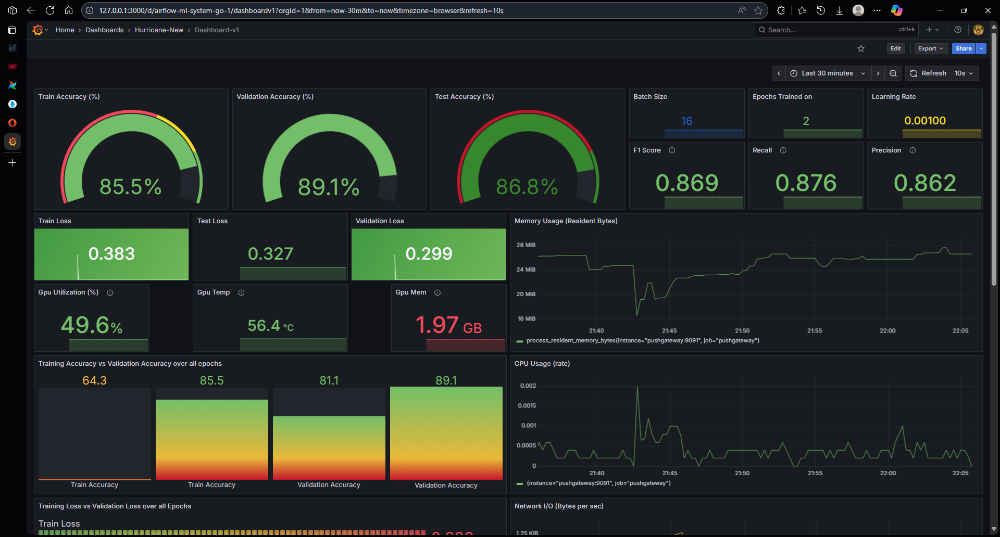

Hurricane Damage Training Pipeline
===================================

An MLOps project for training a CNN model to classify hurricane damage using Apache Airflow, MLflow, and Prometheus monitoring.

What's in the Project
=====================

- **Apache Airflow** - Pipeline orchestration and workflow management
- **TensorFlow/Keras** - CNN model building and training
- **MLflow** - Experiment tracking and model versioning
- **Prometheus** - Metrics collection and monitoring
- **Grafana** - Metrics visualization and dashboards
- **AWS S3** - Dataset and model storage
- **DagsHub** - MLflow tracking server

Grafana Dashboard
=================
